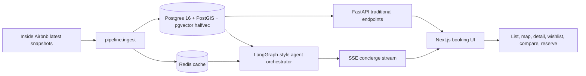

# AI-Native Travel Discovery & Booking Platform

Time actually spent: initial implementation pass in one agent session.

This is a full-stack travel discovery app: a traditional booking product surface backed by PostgreSQL/PostGIS/pgvector, plus an AI concierge that streams visible agent steps. It uses real Inside Airbnb data discovery for Lisbon and London, and ships with a deterministic seed/sample mode so reviewers can run the app without Gemini spend.

## Quick Start

```bash
cp .env.example .env
docker-compose up --build
```

In a second terminal:

```bash
cd backend
python -m pipeline.ingest --mock-llm --sample
```

Open `http://localhost:3000`.

## Architecture



## Stack Choices

Backend is Python 3.11+ with FastAPI for async endpoints, SSE, and Pydantic contracts. Agent orchestration is structured as explicit graph steps compatible with LangGraph patterns because step visibility, state passing, and graceful fallback matter more than free-form role play.

Gemini 2.5 Flash is the reasoning model target, Flash-Lite is the low-cost parser/enrichment target, and `gemini-embedding-001` is truncated to 768 dimensions. PostgreSQL 16 with PostGIS and pgvector stores relational, vector, and geospatial data together, which keeps filtering, retrieval, and transactions simple. Vectors use `halfvec(768)` to reduce storage.

Frontend is Next.js 14, React 18, TypeScript, Tailwind, and a shadcn-inspired component style. Maps are designed around MapLibre/CARTO/OSM with no token requirement.

## Data

The production ingestion path resolves the latest URLs from `https://insideairbnb.com/get-the-data/` for Lisbon and London instead of hardcoding snapshot dates. The seed path creates a small deterministic Lisbon/London corpus for zero-cost demos. Inside Airbnb data is CC-BY 4.0 and must be attributed in deployed UI footers.

## Trade-Offs

- Calendar ingestion is capped at the next 180 days.
- Reviews are stored in full in real ingest design, but embeddings are capped to the 30 most recent reviews per listing and roughly 350K-450K embedded reviews.
- Live deployments should use `--sample` to fit free database tiers; full local ingest is intended for a developer machine.
- Mock LLM mode uses deterministic embeddings, templated sentiment, and summaries so the app runs without `GEMINI_API_KEY`.
- This implementation includes a seed/demo map marker panel; full MapLibre viewport clustering is the next production hardening step.

## Cost Per Query Estimate

At production scale with a cache miss:

- Intent parse: Flash-Lite, about 1,000 input + 300 output tokens = `0.001M * $0.10 + 0.0003M * $0.40 = $0.00022`.
- Retrieval embedding amortized: one short query embedding around 100 tokens = `0.0001M * $0.075 = $0.0000075`.
- Review synthesis: Flash, about 6,000 input + 800 output tokens = `0.006M * $0.30 + 0.0008M * $2.50 = $0.0038`.
- Total cache miss: about `$0.0040`. With 50% cache hit-rate on retrieval/review synthesis: about `$0.0021`.

## What I Would Improve With Another Week

- Complete streaming Gemini structured-output calls with provider usage accounting.
- Add true MapLibre clustering and pan/list synchronization.
- Implement the full chunked CSV COPY path for million-row reviews/calendars.
- Add Playwright browser tests and broader retrieval relevance evals.
- Deploy the sample subset and record the public URL plus Loom.
